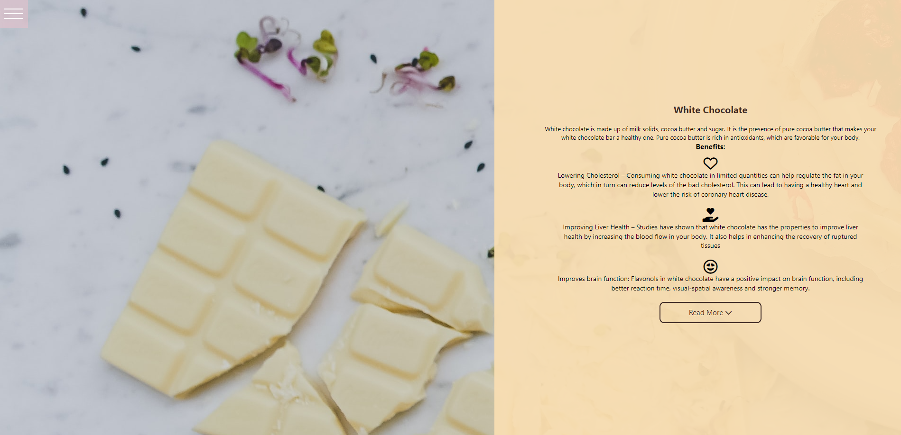

# 🍫 About Website-Building (Chocolate Lovers)

I was given a task @AppleSeeds Bootcamp to to build a responsive website that talks about a certain topic.<br>
I chose to build a website that talks about the benefits of chocolate.<br>
This is a basic site with only one page of `HTML` and `CSS` styling combined with `Transition` `Animations` and `Flex`.

### Home Section

That allows you to view basic details, in smaller screen the navbar will stay the same and the Home Section as well.

### Benefits

This section contains a paragraph without a background image that talks about the benefits of chocolate with a trigger button.

### Dark Chocolate,

### Milk Chocolate,

### White Chocolate,

In these three parts I listed the different advantages of the different types of Dark, Milk and White chocolate.<br>
In the design for the Desktop I used images for each section and for Mobile I used only the background without an image in combination with trigger buttons.

### Contact

In this section I created a contact form combining a background image with a scrolling effect for Desktop and for Mobile a different design.

### Demo site link:

https://toni-z.netlify.app/

### Screenshots





### Deployment

To deploy this project run

```bash
  ./index.html
```
